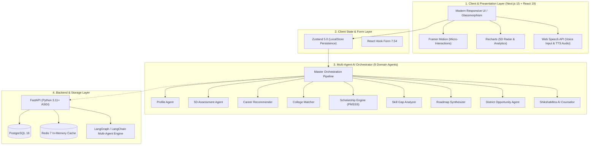
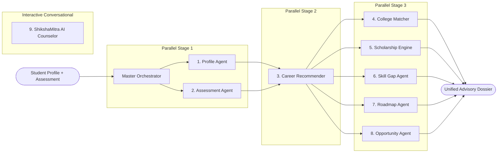

# 🏛️ SHIKSHASETU (शिक्षासेतु / شکھشا سیتو)
## Comprehensive Technology Stack & System Architecture Document
**Government of Jammu & Kashmir | Higher & School Education Department**

---

## 1. 📋 Executive Summary

**SHIKSHASETU** is an enterprise-grade AI advisory platform developed to empower students, parents, counselors, school administrators, and government officials across all 20 districts of Jammu & Kashmir.

The platform is built on a **modern full-stack multi-agent AI architecture** featuring:
- **Next.js 15 & React 19** with App Router architecture
- **Autonomous Multi-Agent AI System (9 Domain Agents + Master Orchestrator)**
- **FastAPI (Python 3.11+)** asynchronous backend
- **PostgreSQL 16 & Redis 7** data and caching infrastructure
- **Zustand 5.0 & React Hook Form** for reactive client state
- **Tailwind CSS & Framer Motion** with government-grade glassmorphic design tokens
- **Recharts & Web Speech APIs** for interactive 5D psychometrics and AI voice counseling

---

## 2. 🏛️ High-Level System Architecture



---

## 3. 🛠️ Complete Technology Stack Breakdown

### A. Frontend Layer

| Technology / Library | Version | Role & Function in ShikshaSetu | Reference |
| :--- | :--- | :--- | :--- |
| **Next.js** | `15.1.3` | Core React framework using the modern **App Router**, server components, route handlers, optimized image rendering, and SEO metadata. | `package.json` |
| **React** & **React DOM** | `19.0.0` | Declarative UI rendering engine with the latest concurrent features, transitions, and component lifecycle management. | `package.json` |
| **TypeScript** | `5.7.2` | Strict static typing across all data schemas, AI agent inputs/outputs, store models, and React component props. | `tsconfig.json` |
| **Tailwind CSS** | `3.4.17` | Utility-first styling engine extended with a custom Jammu & Kashmir Government design token palette (`gov.primary`, `gov.gold`, `gov.green`, `gov.surface`). | `tailwind.config.ts` |
| **Framer Motion** | `11.15.0` | Production-grade physics-based animation library powering smooth tab transitions, staggered card reveals, animated progress gauges, and modal popups. | `package.json` |
| **Recharts** | `2.15.0` | Data visualization library used for:<br>• **5D Psychometric Radar Charts** (`PolarGrid`, `PolarAngleAxis`, `Radar`)<br>• **Future Career Growth Area Charts**<br>• **Stream Enrollment Bar Charts**<br>• **Scholarship Fund Allocation Pie Charts** | `src/app/assessment/page.tsx` |
| **Lucide React** | `0.468.0` | Comprehensive, accessible SVG icon set used across all 11 modules and stakeholder navigation dashboards. | `package.json` |
| **Canvas Confetti** | `1.9.4` | Gamification micro-interaction library triggered upon assessment completion and scholarship eligibility unlocks. | `package.json` |
| **clsx** & **tailwind-merge** | `2.1.1` / `2.6.0` | Utility functions for conditionally merging Tailwind CSS classes without stylesheet specificity collisions. | `src/lib/utils.ts` |

---

### B. Client State Management & Form Handling

| Technology | Version | Purpose in Application | Reference |
| :--- | :--- | :--- | :--- |
| **Zustand** | `5.0.2` | Centralized, ultra-lightweight client store with `persist` middleware storing student profiles, assessment results, chat logs, bookmarked colleges, and selected roles in browser `localStorage`. | `src/lib/store/useAppStore.ts` |
| **React Hook Form** | `7.54.2` | High-performance, un-controlled form state management and input validation for the multi-step Student Profile Engine. | `src/app/profile/page.tsx` |

---

### C. Autonomous Multi-Agent AI System (9 Domain Agents)



| Agent Name | Source File | Core Capabilities & Algorithms |
| :--- | :--- | :--- |
| **1. Profile Agent** | `src/lib/ai/agents/profileAgent.ts` | Socioeconomic vectorization, Career Readiness Index calculation (0–100), and persona badge assignment (*"STEM Prodigy"*, *"Govt Aspirant"*). |
| **2. Assessment Agent** | `src/lib/ai/agents/assessmentAgent.ts` | 5-Dimensional Psychometric Computation across **Analytical**, **Creative**, **Technical**, **Leadership**, and **Communication** dimensions. |
| **3. Career Recommendation Agent** | `src/lib/ai/agents/careerRecommendationAgent.ts` | Multi-criteria decision matching evaluating academic stream, 5D traits, future demand index (2026–2035), and J&K local vs national market fit. |
| **4. College Matching Agent** | `src/lib/ai/agents/collegeMatchingAgent.ts` | J&K Home Quota and AICTE PMSSS supernumerary seat matching across premier institutions (NIT Srinagar, IIT Jammu, KU, JU, SMVDU, GMCs). |
| **5. Smart Scholarship Matcher** | `src/lib/ai/agents/scholarshipAgent.ts` | Automated rule engine evaluating eligibility for **AICTE PMSSS** (up to ₹4.0 Lakhs/yr), **Mission Youth Parvaaz**, **Tejaswini**, **Mumkin**, and **NSP**. |
| **6. Skill Gap Agent** | `src/lib/ai/agents/skillGapAgent.ts` | Diagnoses missing proficiencies and synthesizes custom learning roadmaps using free government courses from **SWAYAM**, **NPTEL**, and **JKEDI**. |
| **7. Roadmap Agent** | `src/lib/ai/agents/roadmapAgent.ts` | Synthesizes a 5-stage chronological milestone plan (Class 10 → Class 12 & Competitive Exams → Degree → Certifications → High Growth Industry). |
| **8. Opportunity Discovery Agent** | `src/lib/ai/agents/opportunityAgent.ts` | Evaluates geo-economic corridors and industrial clusters across all 20 J&K districts (e.g. Lassipora, Ghati, IGC Samba, Rangreth). |
| **9. ShikshaMitra AI Counselor** | `src/lib/ai/agents/counselorAgent.ts` | Multi-turn conversational counselor with prompt suggestions, context retention, and Web Speech voice synthesis. |
| **Master Orchestrator** | `src/lib/ai/orchestrator.ts` | Pipeline coordinator managing agent dependencies, latency tracking, telemetry benchmarks, and unified dossier generation. |

---

### D. Backend & Python AI Services

| Technology | Version | Purpose in Application | Reference |
| :--- | :--- | :--- | :--- |
| **FastAPI** | `>=0.115.0` | High-performance Python ASGI web framework providing asynchronous RESTful API endpoints for student profiles, agent pipelines, and health checks. | `backend/main.py` |
| **Uvicorn** | `>=0.32.0` | Lightning-fast ASGI web server implementation for Python. | `backend/requirements.txt` |
| **Pydantic & Settings** | `>=2.10.0` | Robust schema validation, typed data serialization, and environment configuration management. | `backend/schemas.py` |
| **SQLAlchemy** | `>=2.0.36` | Object Relational Mapper (ORM) powering database persistence for student records, bookmarks, and agent telemetry. | `backend/models.py` |
| **LangChain & LangGraph** | `0.3.10` / `0.2.55` | Stateful multi-agent graph coordination and agentic workflow orchestration. | `backend/requirements.txt` |
| **OpenAI SDK** | `>=1.56.0` | Advanced generative reasoning and natural language synthesis integration. | `backend/requirements.txt` |
| **HTTPX & Python-Multipart** | `>=0.28.0` | Async HTTP client for inter-service communication and multipart request parsing. | `backend/requirements.txt` |

---

### E. Database & In-Memory Caching

| Technology | Version | Role in Architecture | Reference |
| :--- | :--- | :--- | :--- |
| **PostgreSQL** | `16-alpine` | Primary ACID-compliant relational database storing student profiles, assessment answers, institutional data, and scheme records. | `docker-compose.yml` |
| **Redis** | `7-alpine` | In-memory key-value store for session management, API rate limiting, and caching multi-agent responses. | `docker-compose.yml` |
| **asyncpg** | `>=0.30.0` | High-performance asynchronous PostgreSQL database driver for Python. | `backend/requirements.txt` |

---

### F. Browser & Web Platform APIs

* **Web Speech API (`SpeechRecognition` / `webkitSpeechRecognition`)**: Voice input recognition in the ShikshaMitra AI Counselor.
* **Web SpeechSynthesis API (`speechSynthesis`)**: Natural voice text-to-speech audio playback for counseling responses.
* **Web Storage API (`localStorage`)**: Zero-latency offline client-side state caching via Zustand.
* **CSS Paged Media (`@media print`)**: Formats career roadmaps and student dossiers for clean PDF download and physical printing.

---

### G. DevOps, Containerization & Infrastructure

| Tool / Technology | Configuration & Usage | Reference |
| :--- | :--- | :--- |
| **Docker** | Multi-stage Docker containerization for both frontend Next.js application and backend FastAPI services. | `Dockerfile`, `backend/Dockerfile.backend` |
| **Docker Compose** | Multi-container orchestration spinning up `frontend`, `backend`, `db` (PostgreSQL 16), and `redis` (Redis 7) with a single command (`docker-compose up`). | `docker-compose.yml` |
| **Vercel** | Edge deployment and serverless route handling configuration. | `vercel.json` |

---

## 4. 📁 Project File & Module Directory Structure

```text
SIH 2/
├── backend/
│   ├── Dockerfile.backend       # Backend container definition
│   ├── database.py              # SQLAlchemy engine & session factory
│   ├── main.py                  # FastAPI application & REST endpoints
│   ├── models.py                # Database models (Student, Bookmark, etc.)
│   ├── requirements.txt         # Python dependencies
│   └── schemas.py               # Pydantic schemas
├── src/
│   ├── app/
│   │   ├── admin/               # Multi-Agent Health Monitor & Telemetry
│   │   ├── analytics/           # State-wide macro reports & CSV export
│   │   ├── api/                 # Next.js API Routes (chat, orchestrate)
│   │   ├── assessment/          # 5D Psychometric Career Assessment Quiz
│   │   ├── colleges/            # Intelligent College Finder (J&K + PMSSS)
│   │   ├── counselor/           # ShikshaMitra AI Counselor (Voice + Text)
│   │   ├── dashboard/           # Unified Student Command Center
│   │   ├── heatmap/             # 20-District J&K Geo-Economic Map
│   │   ├── profile/             # Student Profile & Persona Engine
│   │   ├── recommendations/     # AI Career Recommendation Trajectories
│   │   ├── roadmap/             # Interactive 5-Stage Career Timeline
│   │   ├── scholarships/        # Smart Scholarship Matcher (PMSSS, etc.)
│   │   ├── skill-gap/           # Skill Gap Analyzer & Course Synthesis
│   │   ├── globals.css          # Core CSS & theme variables
│   │   ├── layout.tsx           # Global root layout
│   │   └── page.tsx             # Main Landing Page with 5 Stakeholder Views
│   ├── components/layout/       # Navbar, Footer, Sidebar, RoleSwitcher
│   ├── lib/
│   │   ├── ai/
│   │   │   ├── agents/          # 9 Domain-Specific AI Agents
│   │   │   ├── orchestrator.ts  # Master Multi-Agent Pipeline
│   │   │   └── prompts.ts       # Structured prompt templates
│   │   ├── data/                # J&K Districts, Colleges, Scholarships, Careers
│   │   ├── store/               # Zustand Global Store (useAppStore.ts)
│   │   └── utils.ts             # Tailwind helper utilities
│   └── types/index.ts           # Unified TypeScript definitions
├── docker-compose.yml           # Full-stack multi-container composition
├── Dockerfile                   # Frontend container definition
├── package.json                 # Node.js dependencies & scripts
├── tailwind.config.ts           # Theme colors, shadows, border radii
└── tsconfig.json                # TypeScript compiler configuration
```
